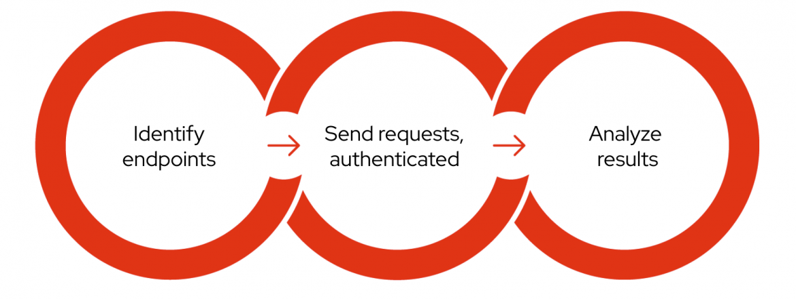
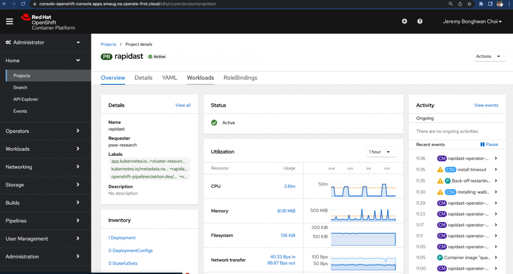

- [Dynamic application security testing (DAST)](#dynamic-application-security-testing-dast)
  - [What is DAST](#what-is-dast)
  - [Phases of DAST](#phases-of-dast)
    - [Identify endpoints](#identify-endpoints)
    - [Send requests](#send-requests)
    - [Analyze results](#analyze-results)
  - [How does DAST differ from SAST](#how-does-dast-differ-from-sast)
  - [RapidDAST](#rapiddast)
  - [Conclusion](#conclusion)

# Dynamic application security testing (DAST)
DAST stands for dynamic application (or analysis) security testing and is a blackbox testing methodology used to uncover potential security flaws by performing automated security scanning against a running target. DAST works by simulating automated attacks on an application, mimicking a malicious attacker. The goal is to find outcomes or results that were not expected and could therefore be used by attackers to compromise an application.

## What is DAST
DAST is usually a term broadly used for testing a running target for security flaws, it usually refers to web-based applications. This has become quite prevalent in the last decade due to the large number of web and
API based applications.

## Phases of DAST

###  Identify endpoints
In order to improve the security of something, the first step is to identify what actually needs to be secured. API scanning starts with identifying endpoints, called attack surfaces, where attackers input malicious data — such as URLs and parameters — in an attempt to compromise the web application. It should be noted that any data in the web requests can be freely modified by attackers.

To automatically identify web endpoints, most DAST tools employ crawling or a spider feature. API endpoints can be difficult to identify with crawling, however API scanning can be done effectively by taking advantage of [OpenAPI.](https://www.redhat.com/en/blog/automated-dynamic-application-security-testing-enhancing-development-security-rapidast#openapi-based-scanning)

### Send requests

Once the endpoints have been identified, DAST tools start sending lots of requests that simulate real attacks. To reach the protected contents, the tools can use established sessions that are normally implemented with cookies or tokens, or even guide users to login to the target.

APIs generally rely on tokens for authentication, whereas most traditional web applications typically use cookies. In some cases, both authentication techniques are used for the same website. It is not uncommon to see the frontend application use a cookie and the backend API use a token at the same time.

### Analyze results

The previous phase results in a lot of responses and results. Analyzing them, with configured scanning rules, can detect security vulnerabilities such as SQL injection and cross-site scripting (XSS), in addition to many other weaknesses such as misconfiguration issues.

## How does DAST differ from SAST
Not all security flaws can be detected by using SAST. Similar to what was mentioned earlier, this is specially true in the case of web applications, where the SAST process may be very effective due to various reasons, including the fact that various combiantions of tools, languages and frameworks are often used to build modern day applications.\
\
Also, web applications tend to have dynamic states depending on user input and several other factors, this is suitable to DAST based testing tools, who are really able to emulate such things and therefore able to test these applications in an effective way.

## RapidDAST

RapiDAST (Rapid DAST) is an open source project to develop a DAST tool that Red Hat Product Security has been working on, [hosted on GitHub.](https://github.com/RedHatProductSecurity/rapidast) RapiDAST is evolving, but at this stage it is focusing on scanning APIs as effectively and conveniently as possible through automation. The project is currently making use of [OWASP ZAP](https://www.zaproxy.org/) — a popular open source web security testing tool — as its core engine.

There is an excellent blog on RapidDAST at:
https://www.redhat.com/en/blog/automated-dynamic-application-security-testing-enhancing-development-security-rapidast

## Conclusion
If you have a web or a cloud based application, DAST is the most effective security testing mechanism and should be an integral part of your Software Development lifecyle.
