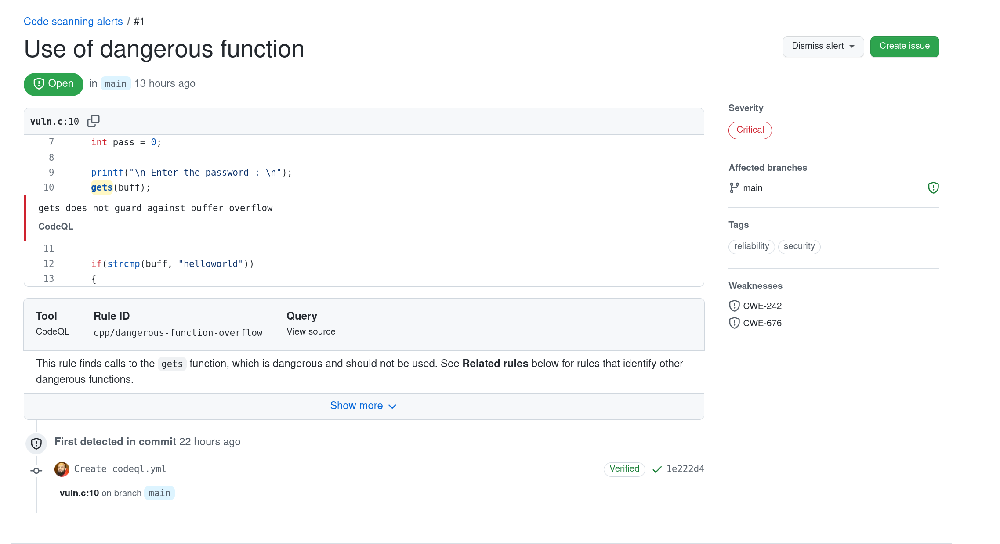

- [Static Application Security Testing (SAST)](#static-application-security-testing-sast)
  - [Introduction](#introduction)
  - [Why do SAST?](#why-do-sast)
  - [SAST process and workflow](#sast-process-and-workflow)
  - [When to do SAST](#when-to-do-sast)
  - [SAST tools](#sast-tools)
  - [Analyzing the output](#analyzing-the-output)
  - [Closing words](#closing-words)

# Static application security testing (SAST)

## Introduction
Also known as static analysis, this method works by running specialized software called static analyzers on the application source code. Static Analyzers use an internal model of the execution process of the application and based on in-built rules they are able to detect anomalies with the source code. Some of these issues can result in security flaws. A lot of common vulnerability classes can be detected by using static analyzers. 

## Why do SAST?
- SAST tools can give developers early feedback about the quality of their code and help detect security flaws even before the code is built and testing by QE. This initial detected of flaws can result in quick resolution of issues very early in the development cycle.
- Most SAST tools are able pin point the exact location of code, which caused the security flaw as compared with other efforts like fuzzing etc. This helps developers eliminate risky parts of code, even if the developer has very limited security experience. 
- Another key advantage of the SAST process, is that 100% of the codebase is analyzed, even difficult to reach branches or dead code. 
- Its much faster than manual reviews or code-audits

## SAST process and workflow
- **Choose the right tool for the right job:** This really depends on your code base and the place in the build/release pipeline where you want the scan can run. There are lot of free tools available, so unless your requirements are really specific, there is no need to spend too much!
- **Setup the tool:** Most tools need configuration. There are rules for parsing code, some tools are self learning also. Often the best configuration really comes with using the tool for some time.
- **Scan:** This is the best part! You actually run the first scan and see how it goes, what results are produced. First scan always produces lot of output. That should not overwhelmn you though. Expect false positivies also, most scanners should have some feedback loop so that these can be avoided in the future.
- **Record the results and fix flaws/bug:** If your scanner cannot save scan logs, make sure you save them somewhere you will have later access to. Parsing the logs is very important, to ensure that you dont miss anything important. Sometimes developers will just skip bugs and focus on any security flaws found, that should be fine as well. But looking at the logs carefully to ensure that security warnings are not missed is very important.
- **Rinse and repeat:** Now, that your first scan is done, you need to ensure that scanning is done at regular intervals, atleast before a release.

## When to do SAST
SAST is more useful when done very early in the pipeline. Some web/cloud based SAST tools, run their scanner as soon as code is commited to a repository. This allowers developers to immediately fix the issue at hand. Some even run it during the CI/CD pipeline and block the commit if anything serious is found. Doing it later specially after QE testing is often results in wasted resources since the application will need to be patched and QE run again on it.

## SAST tools
While this document is not about discussing SAST tools. There are some important points which should be considered when making a decision:
- **What language/framework is your project written in:** SAST scanners are typically language specific or atleast support families of languages. It is rare to find a scanner which supports all possible available languages
- **Where is it hosted:** You may want to use a cloud based online SAST scanner or use one which can be hosted in a private network. Both of them obviously have pros and cons
- **Lastly, the capabilities of the scanner:** Though SAST scanners are evolving, they are not perfect. Decisions are normally based on speed, accuracy, easy of deployment/configuration, cost and other factors.

## Analyzing the output
Different SAST tools provide output in different ways either as log files, or XML or sometimes even JSON. In the end the purpose of this exercise is to find flaws and fix them, therefore looking at the output in a proper way is most important. Various automation approaches can be used to parse longer log files. Also it does not hurt to get multiple people to see them, sometimes developers take their own code for granted and some mistakes can only be spotted by others.\
\
Several SAST tools integrated with CI/CD pipelines show verbose errors during commit process and they can be mitigated pre-built itself. The picture below shows a typical SAST warning from a GitHub Scanning workflow:

## Closing words
One important aspect of dealing with SAST scans is the rate of "false positives". Though SAST tools are getting better with time, sometimes because of complexity of the codebase or even a particular language, there are always false positives (or even sometimes false negatives). A proper method of dealing with them and avoiding them in future is a key to success in this process.

**Overall, SAST is an important process to catch flaws early in the lifecyle and when properly integrated with the pipeline can serve as an important tool for improving overall security of any project.**

