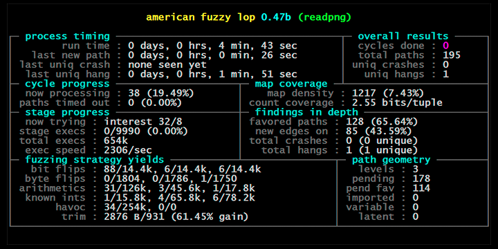

# Fuzzing

## Introduction
Fuzzingt is the process of throwing random (but sometimes organized) data to an application and observing how the particular application behaves. This is especially useful from a security perspective as sometimes applications crash or behaves unexpectedly when fed with invalid data. This kind of behaviour can be exploited by attackers to gain access to sensitive data, or even run arbitrary code.\
\
Consider one of the simplest examples, where random data is sent to a particular port to test a service.\
\
<code>
while [1]; do cat /dev/urandom | nc -vv target port; done
</code>
\
\
The service is then observed to the moment it crashes, we know that there is some random data combination somewhere which can crash the service. Though reproducing this kind of crash may be very difficult, unless we have some packet capture mechanism which can exactly record the incoming data and the various states reached by the service because of that.\
\
In the sections below, we will have a brief look at the science behind fuzzing and how it can help secure open source development process. Fuzzing has reached a high maturity level, and this single page of documentation cannot do justice to the various nuances of the process but intends to present a very high-level view of what the process is and how it can be helpful.

## Fuzzers
Specialized applications or libraries can be used for fuzzing depending on the application and what input it requires. Let's try to look at some of the broad categories:

### File based fuzzers
Applications which process files in some way, for example, image manipulation libraries, data parsers etc, can be tested by using these fuzzers. The fuzzer essentially mangles the files in a fuzzing corpus and iteratively passes them to the application to observe if the application crashes. If there is a crash the fuzzer can either stop or can continue to produce/record any further crashes. Researchers normally leave these fuzzers running and may interfere only if the fuzzing stops due to some reason. The output of the fuzzing process is then analyzed on a regular basis to check if any flaws/bugs have been found.

### Protocol based fuzzers
These are usually written for a specific network protocol and therefore are highly specialized. They usually work by sending mangles protocol packets over the wire or the loopback interface to a designated service and then observing how the service reacts. One such free TLS protocol fuzzer with [tlsfuzzer.](https://github.com/tlsfuzzer/tlsfuzzer)  While it uses fuzzing techniques for testing (randomisation of passed-in inputs), the scripts are generally written in a way that verifies correct error handling: unlike typical fuzzers, it doesn't check only that the system under test didn't crash, it checks that it returned correct error messages.

### Web application fuzzers
Since web appliations are specialized applications, they need special fuzzers. You may perhaps add [browser fuzzers](https://security.googleblog.com/2019/07/chrome-fuzzer-program-update-and-how-to.html)  in this category also. They can be of various types, depending on what you want to find. For example, some of them are [specialized web app security testers](https://portswigger.net/burp/communitydownload), while others can use to used to find [SQL injection issues in your web application](https://sqlmap.org/). The options available here are just too many to list in this document.

### Instrumented fuzzers
Not strictly a different category, but instrumented fuzzers insert small hooks into the code during the compile process, which ensures that all parts of the code get good coverage. Therefore you need the source code to be available and needs to be compiled with the fuzzer libraries. Recently these kinds of fuzzers have been quite successful at finding a huge number of previously uncovered flaws in various applications and libraries.\
\
One very good example of Instrumented fuzzers is [American fuzzy lop](https://lcamtuf.coredump.cx/afl/). Compared to other instrumented fuzzers, afl-fuzz is designed to be practical: it has modest performance overhead, uses a variety of highly effective fuzzing strategies and effort minimization tricks, requires essentially no configuration, and seamlessly handles complex, real-world use cases - say, common image parsing or file compression libraries.\
\
Diagram below shows AFL in action (Image taken from its website at: https://lcamtuf.coredump.cx/afl/)\

## Understanding resource requirements for fuzzing
Fuzzing is a resource-intensive process, which needs time, computing resources etc. In the end, both translate to more money. So it's a business decision to figure out how much money should be spent to uncover flaws using this technique or using other techniques described in this guide like SAST for example or code reviews. It is always useful to fuzz any API endpoints or user interfaces like login screens etc, which are open on the internet. As compared to that applications on the intranet may not be given so much importance given the fact that they are exposed to a limited audience internally.

## When is fuzzing useful?
As described above, applications on the internet or untrusted networks are easy targets for attackers and fuzzing could help discover flaws in them. Typically applications which need a lot of user steps may not be good fuzzing targets for example consider an internal company application which needs a login after which you have to get a Kerberos ticket and then can be used to upload expense reports, such applications may be difficult to fuzz or may require more specialized techniques. 

## Some open source fuzzing initiatives
Recently several open source initiatives were made available especially for open source projects who did not have enough resources to run their own fuzzing infrastructure. We list two of these in the sections below

### OSS-Fuzz
[OSS-Fuzz is a free service](https://google.github.io/oss-fuzz/) that continuously runs fuzzers for open source projects. This GitHub repository manages the service and enrolling in it is handled by pull requests. Once a project has integrated with OSS-Fuzz, the fuzzers affiliated with that project run daily—continuously and indefinitely. OSS-Fuzz emails maintainers when a bug is found and also has a dashboard with details about all issues found (stack traces, artifacts for reproducing issues, and so on). OSS-Fuzz aims to make common open source software more secure and stable by combining modern fuzzing techniques with scalable, distributed execution. To be accepted to OSS-Fuzz, an open-source project must have a significant user base and/or be critical to the global IT infrastructure. 

### ClusterFuzz
[ClusterFuzz](https://github.com/google/clusterfuzz) is a scalable fuzzing infrastructure that finds security and stability issues in software. It provides scalable fuzzing on a cluster of any size. [Clusterfuzz is open source](https://opensource.googleblog.com/2019/02/open-sourcing-clusterfuzz.html) and availble for any one to use. 

Both of these open source initiatives are provided by Google.

## Closing remarks
Fuzzing is an excellent method of discovering flaws. But it's resource intensive. Though the right combination of identification of high-value targets and fuzzing methods can help uncover and fix a lot of security flaws and help organizations save money in the long term.
