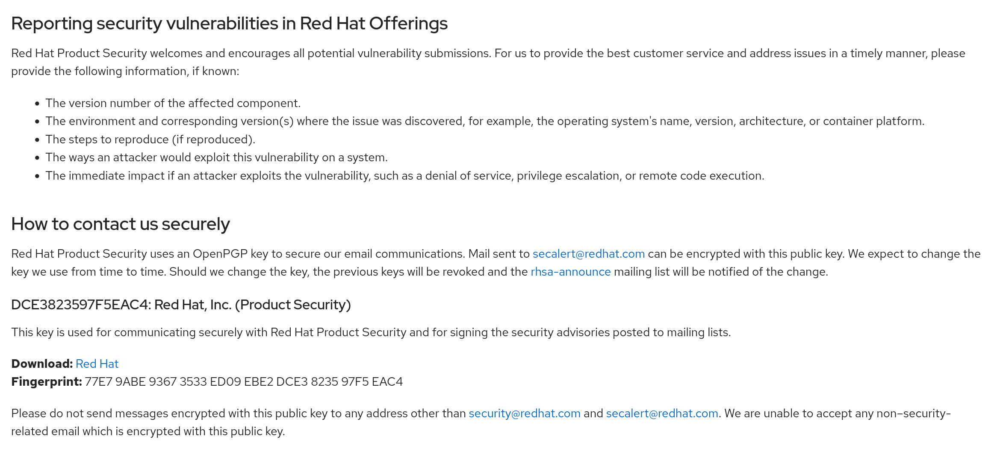
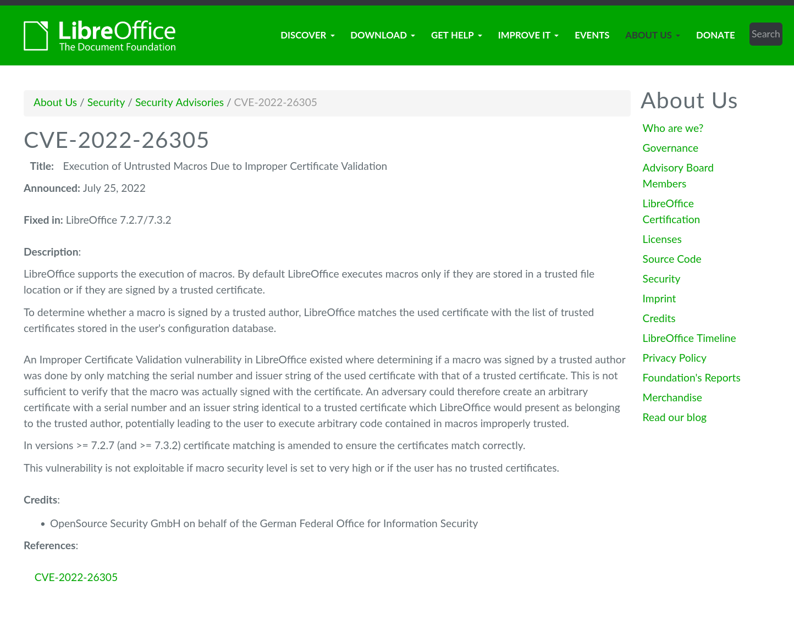

# Vulnerability Response

## Introduction
Vulnerability Response response in a very important part of secure development. Rather than pro-active security it rather lays down the rules and procedures about how to handle an incident, when a security flaw has been found by someone, how to report such incident, track then, fix them, make them public if required and how to document them so that they can be easily consumed by users.

## Clearly documenting where probable security flaws are to be reported
This should be present on the front page of the project site or whereever its web presence is. 
- If you are the only developer of this project clearly mention your name and email address or any other way you would like to recieve security reports of your project. If there are mulitple developers, then a designated person who will recieve these emails or reports. It is often preferable to create a <security@project-name.domainname.com> instead of personal email addresses, reporters often feel more comfortable reporting to this address rather than anywhere else.
- How do you want your reports to be sent is also another useful thing here. Some researchers dont like plain text reports, they prefer GPG encrypted. Can you support that? otherwise you can mention that we prefer plain text reports only. 
- Public or not? This is a very important question for researchers, developers and users. If your reported issue is serious and may cause harm to your users for example, you have a web application and a easy SQL injection issue was found, if you make it public without fixing it, it may lead to your users getting compromised. Under such conditions you want want to keep it embargoed till you are able to fix the issue first. It all really depends on what the issue is and how important your project is.
- Work with the reporter, on how he found the flaw, how to reproduce it, maybe share the patch with him, he may be able to find further flaws if the patch was not sufficent. 
- Once you have a patch, test it again, its a security flaw, you dont want your patch to lead to other future flaws, that would really mean bad reputation for your project.
- Think of metadata, do you want to assign CVE etc to the flaw, some projects prefer some other ID mechanism. Some way of intendifying "this" flaw from "that" would be useful to everyone.
- Lastly think of how you want to release it. Do you just want to do a tuesday release by making patch public and spinning a new tarball or are there some other things which need to fall in place, before you can do the release.
- Also think of how you want to write security advisories. We will talk about them in the sections below.

## What should a security report contain:
At the very minimum, what the issue is, what version if affects, how it can be reproduced, what environment the researcher used to reproduce the issue and if he has any Proof of Concept if any. \
\
For example refer to [Red Hat's security page](https://access.redhat.com/security/team/contact) on how to contact the security team and what information we woud probably need. You dont have to have an efficient and large security team, but the basic information remains the same.
<kbd>
</kbd>

## Security advisory
Now that you have resolved the security issue with your software and released a fixed version, how do you let the users know that a new version which fixes security issues is available? One way of doing this is to write a security advisory page for each issue found. The advisory should contain at the minimum, some basic information about what the security flaw was, what is the possible risk to the users, which version fixes it, any other mitigating factors and some metadata like CVE id if required.\
\
Diagram below shows a typical security advisory, this one is from the LibreOffice project and has all the essential information users would every require:

Most people think you need some security background to write a good advisory, but that is not really the case. An advisory is supposed to be consumed by the users of the application and not some security engineer, so keep it simple and provide all the important information which is required.

## Set proper lifetime of your software
If you are working on various versions of the your software, you will eventually reach a point where you cannot continue manintaining all of them. Therefore it is necessary to sunset older versions at some point of time. Ensure you have a plan for this, this is important from security perspective as well, because yours users may still be user older versions not aware of the fact, that you dont backport security issues to the older versions anymore.

## Conclusion
A basic Vulnerability Response program is very important. It can be a web page which just says how you handle security, does not need to be fancy, but just a simple process which is operational.
